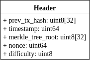
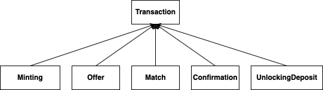
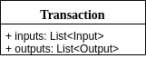
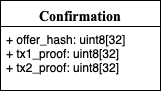
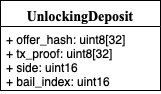

# chasm

[](http://jenkins.xpeer.network/job/chasm/job/master/)
[](http://jenkins.xpeer.network:5000/coverage/chasm/job/master)

# Overview

Bachelor's Thesis PoC

## Installation

The following packages must be installed:
```
leveldb
```

## Protocol







  
#### Simple transfer


xpeer's transactions are quite similar to [Bitcoin's UTXO](https://www.mycryptopedia.com/bitcoin-utxo-unspent-transaction-output-set-explained/).
That amount of money comes from usually multiple inputs and is sent to at least one address. It is clear when one send all funds into another address,
but when somebody want to spend only a part of it, the rest is sent back to the owner's address. There must be a mining fee to encourages miners to 
include that transaction in a block. The mining fee is a difference between inputs and outputs and is not defined directly, one must remember to make some part of that funds left.
```Maining fee = Input 0..N - Output 0..N```

#### Making an offer


#### Offer acceptance


#### Transaction confirmation


#### Unlocking deposit


#### Way of using funds


## System architecture